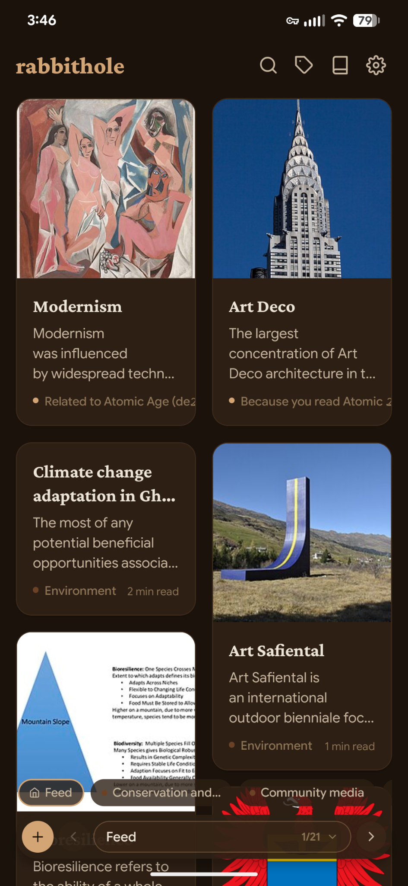
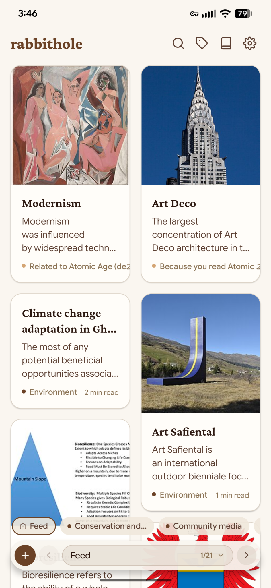
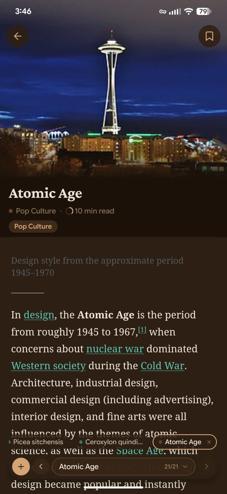
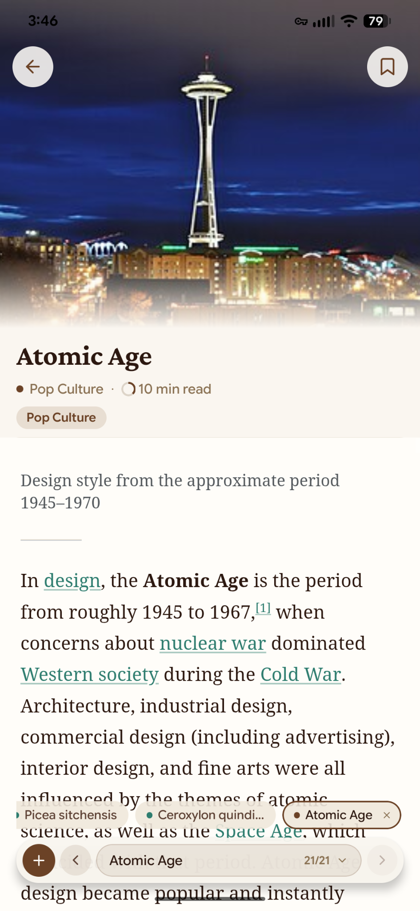
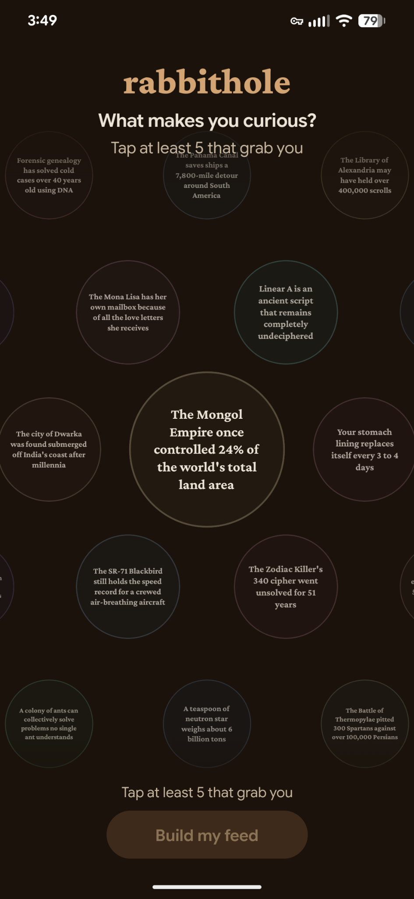
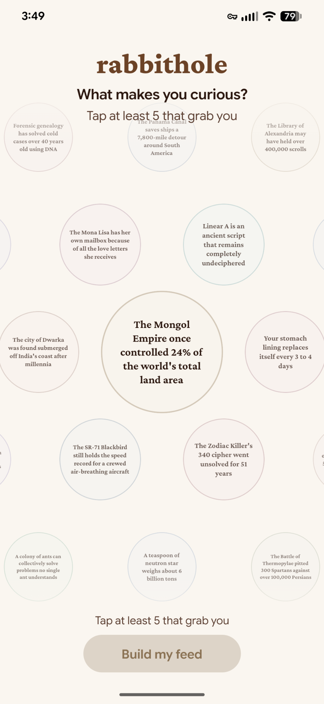
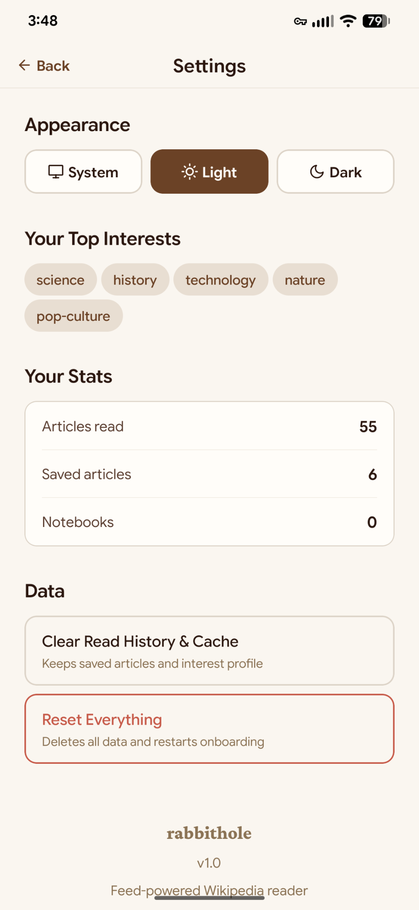
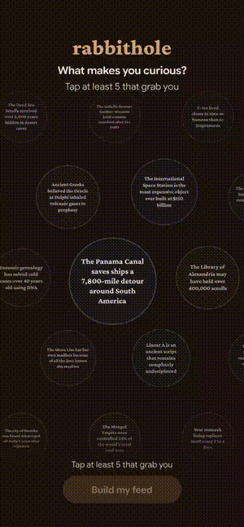

# RabbitHole

An intentionally addictive Wikipedia reader. TikTok-style feed mechanics applied to real knowledge instead of brain rot.

8-pool recommendation engine that learns your interests, detects flow states, and optimizes for curiosity. Fully client-side — no server, no auth, no accounts, no tracking. Everything runs on-device.

## Screenshots

| Feed (Dark) | Feed (Light) | Article (Dark) | Article (Light) |
|---|---|---|---|
|  |  |  |  |

| Onboarding (Dark) | Onboarding (Light) | Settings |
|---|---|---|
|  |  |  |



## Stack

| Layer | Tech |
|---|---|
| Framework | Expo 54, React 19, React Native 0.81 |
| UI | Tamagui 1.144, Feather icons via `@expo/vector-icons` |
| State | Zustand 5 with AsyncStorage persistence |
| Navigation | React Navigation (native stack + drawer) |
| Data Source | Wikipedia REST API + Action API |
| Fonts | Google Sans Flex, Crimson Pro |
| Images | `expo-image` |
| Platforms | Web, Android (APK via Gradle), iOS |

## Quick Start

```bash
# Install dependencies
npm install

# Web (use port 8090 — port 8081 is taken by another project)
npx expo start --web --port 8090

# Android APK
npx expo prebuild --platform android --clean
cd android && ./gradlew assembleRelease
# Output: android/app/build/outputs/apk/release/app-release.apk

# iOS
npx expo run:ios
```

## Project Structure

```
src/
├── components/
│   ├── CategoryChip         # Selectable category pill (onboarding + topics)
│   ├── FeedCard             # Vertical article card (6 variants: standard, fact, thread, trending, bridge, quote)
│   ├── FloatingTabBar       # Floating nav overlay (back/forward/home + tab tree dropdown)
│   ├── HoneycombGrid        # Pan/drag hexagonal grid for onboarding hook selection
│   ├── HookCard             # Individual curiosity hook hexagon cell
│   ├── ImageViewer          # Full-screen image viewer
│   ├── KeepGoingCards       # "See Also" ranked suggestions at article bottom
│   ├── SavePathModal        # Save current tab tree as a named path
│   ├── SaveToNotebookModal  # Save articles to notebook collections
│   ├── ScreenContainer      # Flex wrapper that fixes RN Web height issues
│   ├── SkeletonCard         # Animated loading placeholder matching FeedCard layout
│   ├── TabPillStrip         # Horizontal scrolling article tab pills
│   ├── TabTreeDropdown      # Hierarchical tree view of open tabs
│   └── WebLayoutWrapper     # Max-width centering wrapper for web
├── hooks/
│   ├── useFeedLoader        # Feed generation, refresh, infinite scroll, prefetch buffer
│   └── useResponsive        # Breakpoint detection (mobile/tablet/desktop)
├── navigation/
│   ├── AppNavigator           # Root: Onboarding → Main routing
│   ├── ResponsiveNavigator    # Desktop (>=1024px) → Drawer, else → Mobile stack
│   ├── MobileNavigator        # Stack: Browse, Topics, Notebooks, NotebookDetail, History, Settings
│   └── DesktopDrawerNavigator # Permanent 240px sidebar + nested stacks
├── screens/
│   ├── BrowseScreen         # Tab container: feed + article tabs with floating nav
│   ├── FeedScreen           # Infinite scrolling FeedCards with search
│   ├── ArticleScreen        # Full article reader (iframe on web, WebView on native)
│   │   ├── ArticleHero      # Collapsible hero image with metadata overlay
│   │   ├── ArticleRenderers # Platform-specific article rendering
│   │   └── ReadProgressRing # Circular scroll depth indicator
│   ├── OnboardingScreen     # Honeycomb curiosity hook selection (min 5)
│   ├── TopicsScreen         # Category/subcategory browser with toggle controls
│   ├── NotebooksScreen      # Notebook list with create/rename/delete
│   ├── NotebookDetailScreen # Saved articles in a notebook
│   ├── HistoryScreen        # Browsing history with scroll depth restoration
│   └── SettingsScreen       # Theme, stats, data management, reset
├── services/
│   ├── wikipedia            # All Wikipedia API calls (throttled, max 4 concurrent, 50ms stagger)
│   ├── curiosityHooks       # 70 curated opening hooks (scarcity, mystery, superlative, conflict, contrast, number)
│   ├── categoryData         # 18 categories with subcategories + wiki category mappings
│   └── feedAlgorithm/
│       ├── index            # Orchestrator: pool allocation, arrangement, dedup, variant assignment
│       ├── tuning           # All tuning constants and pattern regexes
│       ├── poolAllocation   # Dynamic allocation with flow state detection
│       ├── poolFetchers     # 8 pool data fetchers (category, link, events, discovery, momentum, continuation, exploration, bridge)
│       ├── curiosityScoring # Multi-signal article scoring (0-1 scale)
│       ├── cardVariants     # Variant assignment logic (fact, thread, trending, bridge, quote, standard)
│       ├── excerptOptimization # 3-tier excerpt rewriting (templates → reorder → cliffhanger truncation)
│       ├── decayedProfile   # 7-day half-life temporal decay for interest weights
│       └── helpers          # Dedup, shuffle, jitter utilities
├── store/
│   ├── articleStore         # Article cache (max 200, LRU eviction)
│   ├── feedStore            # Current feed items + loading state (not persisted)
│   ├── interestStore        # Interest profile with weighted categories
│   ├── interest/
│   │   ├── index            # Store definition + signal dispatchers
│   │   ├── interestSignals  # All engagement signal handlers
│   │   ├── interestHelpers  # Category matching, weight updates
│   │   └── interestPersistence # AsyncStorage load/save
│   ├── notebookStore        # Saved articles + notebook collections + paths
│   ├── tabStore             # Tab tree: parent/child navigation, scroll depth per tab
│   ├── sessionStore         # Session state (articles read, flow detection)
│   ├── historyStore         # Browsing history with scroll restoration
│   ├── onboardingStore      # Onboarding progress + selections
│   └── themeStore           # Theme mode (system/light/dark)
├── theme/
│   ├── colors               # Earthy palette: light (#FAF6F0) / dark (#1A120B)
│   ├── typography           # Google Sans Flex + Crimson Pro with mobile/desktop variants
│   ├── breakpoints          # mobile(0), tablet(768), desktop(1024), wide(1440)
│   └── index                # useThemeColors(), spacing, borderRadius, shadows
├── types/
│   └── index                # All TypeScript interfaces and navigation param types
└── utils/
    ├── platform             # isWeb, isMobile, isAndroid, isIOS helpers
    ├── categoryMapping      # Article → category resolution
    ├── haptics              # Haptic feedback (native only)
    ├── hexGrid              # Honeycomb geometry calculations
    ├── readTime             # Article read time estimation
    └── shadows              # Cross-platform shadow conversion (boxShadow on web)
```

## Architecture

### Feed Algorithm

The feed generates articles from 8 pools, fetched in parallel with dynamic allocation that shifts based on engagement patterns:

| Pool | Base Share | Source | Purpose |
|---|---|---|---|
| **Category** | 30% | Wikipedia categories weighted by user interests | Core personalization |
| **Link** | 25% | "See Also" links from recently-read articles | Thread continuation |
| **Current Events** | 15% | Today's most-read + news, filtered by interest overlap | Timeliness |
| **Discovery** | 10% | "Curiosity magnet" categories (paradoxes, mysteries, world records) | Surprise |
| **Momentum** | 10% | Related to last-read article | Flow state fuel |
| **Continuation** | 5% | Unfinished threads from previous sessions (>1 day gap) | Return hooks |
| **Exploration** | 5% | Low-weight categories (<0.15) novel to the user | Horizon expansion |
| **Bridge** | 0-3 items | Topic pairs detected via co-occurrence (3+ articles) | Cross-domain connections |

Target: 30 items per full generation, 15 per load-more.

#### Dynamic Allocation Adjustments

Allocation shifts in real-time based on:

- **Flow state detected** (high engagement velocity) → override to 40% momentum, 30% links, 20% category, 5% discovery
- **Source CTR** — high click-through pools get up to +15% allocation
- **Session depth** — at 5+ articles, shift toward momentum + discovery
- **Same-topic streak** — at dynamic threshold (3-6 depending on read depth), inject discovery
- **Time of day** — mornings boost current events, nights boost deep reads
- **Thread depth** — at 3+ levels deep, boost link pool +15%
- **Return context** — after >1 day gap, boost continuation pool

#### Feed Arrangement

Articles aren't just ranked — they're **position-aware arranged**:

- **Positions 0-1**: Highest engagement potential (hooks)
- **Positions 2-4**: Comfort zone (top user categories)
- **Every 5-8 items**: Surprise injection (discovery/bridge)
- **Interspersed**: Momentum articles to maintain flow
- **Max 2 consecutive**: Same tone classification (dramatic, mysterious, biographical, scientific, lighthearted)

### Curiosity Scoring

Every article is scored 0-1 on multiple psychological signals:

| Signal | Bonus | Example |
|---|---|---|
| Question in title | +0.15 | "Why Did the Roman Empire Fall?" |
| Superlative | +0.12 | "largest", "first ever", "deadliest" |
| Mystery words | +0.15 | "unknown", "unexplained", "paradox" |
| Conflict/drama | +0.10 | "death", "war", "disaster" |
| Numbers/lists | +0.08 | "7 Wonders", "Top 10" |
| Scarcity pattern | +0.10 | "only", "last remaining" |
| Ideal title length (3-8 words) | +0.05 | Sweet spot for curiosity |
| Long excerpt (>100 chars) | +0.05 | More material to hook with |

Contextual modifiers also apply:
- **Adjacency bonus** (+0.20): Category weight 0.1-0.6 (the "curious but not saturated" sweet spot)
- **Novelty bonus** (+0.15): No category overlap with user profile
- **Saturation penalty** (-0.10): Category weight >0.7 (too familiar)

### Card Variants

FeedCards aren't uniform — variant is assigned based on context:

| Variant | Trigger | Display |
|---|---|---|
| **Fact** | High curiosity + no thumbnail, or discovery pool | Single surprising claim extracted from excerpt |
| **Thread** | Momentum/continuation at depth >2 | "3 deep in your rabbit hole" |
| **Trending** | Current events pool | "Trending now" badge |
| **Bridge** | Topic co-occurrence detection | "Cross-topic discovery" |
| **Quote** | Reserved for notable quotations | Stylized quote format |
| **Standard** | Everything else | Hero image + excerpt |

### Excerpt Optimization

Excerpts are rewritten for maximum curiosity through a 3-tier pipeline:

1. **Template patterns** (highest priority) — e.g., short lifespan "(1856-1890)" → "Lived only 34 years." Buried superlatives pulled to front.
2. **Sentence reordering** — sentences scored for curiosity signals, highest-scored leads if >0.15 advantage over original. Definitional openings ("X is a...") penalized.
3. **Cliffhanger truncation** — cut at ~200 chars, preferring words like "but", "however", "when", "until", "although". Falls back to sentence boundary.

Fact cards use `extractSurprisingClaim()` for a single-sentence hook.

### Interest Learning

The interest system adjusts category weights based on engagement signals:

| Signal | Effect | Trigger |
|---|---|---|
| Article opened | +0.05 weight | Navigating to article |
| Article read | +0.02 to +0.10 | Time-based (>3s, scales with duration) |
| Deep read | Extra multiplier | >40% scroll depth |
| Article saved | +0.15 weight | Saving to any notebook |
| Link followed | +0.08 + co-occurrence | Tapping a Wikipedia link within article |
| Scrolled past | -0.01 weight | Card leaves viewport without tap |
| Card dwell | Discovery echo | Milliseconds focused on card |
| Search query | Intent signal | Search submitted |
| Search result tap | Explicit interest | Tapping a search result |
| Path saved | Thread reward | Saving a multi-hop tab chain |

All weights decay with a **7-day half-life** — interests fade but never fully reset (floor: 0.02), enabling rekindling on return.

### Tab Tree System

Navigation is a tree, not a stack:

- **Feed tab**: Root, always present
- **Article tabs**: Branch from feed or from other articles (via links)
- **Tree structure**: Each tab has `parentId`, `childIds`, `mostRecentChildId`
- **Scroll depth**: Preserved per tab for restoration
- **Paths**: Save entire tab trees as named "rabbit holes" (max 50), restorable with full scroll positions

### Onboarding

1. Honeycomb grid of 70 curated curiosity hooks (pan/drag to explore)
2. Tap hexagons to select (minimum 5 required)
3. Hook styles: scarcity, mystery, superlative, conflict, contrast, number
4. Selections initialize the interest profile with category weights (0.5 for categories, 0.7 for subcategories)
5. First 3 feed generations get quality gates (min 120-char excerpts, prioritize thumbnails, 60/20/20 split)

### Wikipedia API

All calls go through throttled fetch with max 4 concurrent requests and 50ms stagger. Two APIs:

- **REST API** (`/api/rest_v1/`) — Article summaries, featured content, mobile HTML
- **Action API** (`/w/api.php`) — Category members, links, search, random. Uses `origin=*` for CORS.

`User-Agent` header only sent on native platforms — browsers block it via CORS preflight. Thumbnail URLs scaled to 640px via regex replacement.

### State Persistence

All Zustand stores persist to AsyncStorage with `@rabbithole:` key prefix:

| Store | Key(s) | Notes |
|---|---|---|
| themeStore | `themeMode` | system/light/dark |
| onboardingStore | `onboardingStatus`, `Categories`, `Subcategories` | |
| interestStore | `profile` | Max 500 history, 1000 log entries, 7-day decay |
| articleStore | `articles` | Max 200, LRU eviction |
| notebookStore | `notebooks`, `savedArticles`, `paths` | Max 50 paths |
| tabStore | `tabs` | Full tree + active tab + scroll positions |
| historyStore | `history` | Browsing history with scroll depth |
| feedStore | Not persisted | Regenerated each session |

### Navigation

```
AppNavigator (root)
├── OnboardingScreen (if not completed)
└── ResponsiveNavigator
    ├── MobileNavigator (width < 1024)
    │   └── Stack: Browse, Topics, Notebooks, NotebookDetail, History, Settings
    │         └── BrowseScreen contains: Feed ↔ Article tabs (tree navigation)
    └── DesktopDrawerNavigator (width >= 1024)
        ├── Permanent 240px sidebar
        ├── BrowseStack: Feed ↔ Article tabs
        ├── TopicsStack
        ├── NotebooksStack: List → Detail → Article
        ├── History
        └── Settings
```

### Theme

Earthy encyclopedia palette with full light/dark support:

| Token | Light | Dark |
|---|---|---|
| primary | `#6B4226` (earth brown) | `#D4A574` (golden amber) |
| background | `#FAF6F0` (parchment) | `#1A120B` (deep tunnel) |
| textPrimary | `#2C1810` | `#EDE4D8` |
| link | `#2E7D6F` (deep teal) | `#5CC4B0` (bright teal) |

Display font: Crimson Pro. Body font: Google Sans Flex. All colors via `useThemeColors()` hook. No emojis — all icons are thin Feather line icons. Custom earthy scrollbars on web.

## The Addiction Loop

```
Hook (onboarding) → Comfort (top categories) → Surprise (discovery injection)
→ Thread (link following) → Keep Going (see also) → Momentum (flow state)
→ Return (continuation pool) → Hook (next session)
```

The feed doesn't just show you articles — it **arranges** them to exploit curiosity gaps, detect when you're in flow, amplify momentum, inject surprise at optimal intervals, rewrite excerpts for cliffhangers, and bring you back with unfinished threads. All pointed at Wikipedia instead of short-form video.

## Gotchas

- **Port 8081 conflict**: Use `--port 8090` for web dev.
- **CORS on web**: Wikipedia blocks custom `User-Agent` headers from browsers. `throttledFetch` conditionally omits it on web.
- **`displaytitle` HTML**: Wikipedia REST API returns HTML-tagged titles — stripped via `stripHtml()` before storing.
- **Feed auto-load timing**: `useFeedLoader` watches for `hasProfile` to trigger initial load, handling the case where FeedScreen mounts before onboarding completes.
- **Android APK**: Run `npx expo prebuild --platform android --clean` before first Gradle build.
- **Tamagui config**: Exists at project root but the app primarily uses RN StyleSheet + custom theme rather than Tamagui components.
